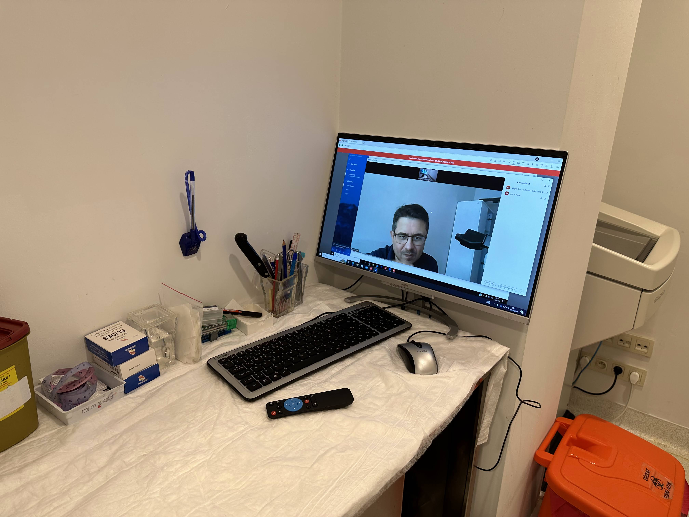
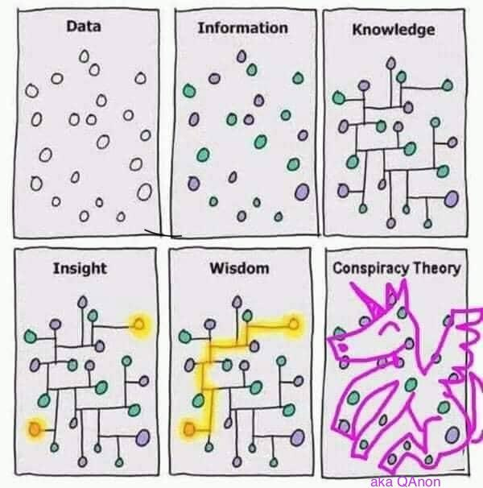
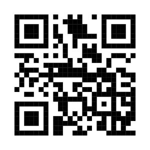

# Dijital Patoloji Nedir Ki?


## Dijital Patoloji Nedir Ki?


::: {.notes}
Dijital patoloji deyince aklımıza hemen scanner geliyor. Koca bir makina ve değişik bir şey olduğu için ona odaklanıyoruz. Ama aslında tarama cihazları dijital patoloji için kısmen gerekli olsalar da yeterli değiller. 
:::


## Dijital Patoloji Nerede Kullanılıyor? - Konsültasyon 


::::: {.columns}

:::: {.column width="40%"}


-   Konsültasyon
    -   Frozen

:::: 


:::: {.column width="60%"}


::::


::::: 


::: {.notes}
Kısmen gerekli olsalar da dedim, çünkü dijital patolojiyi konsültasyonlar için cep telefonlarıyla kullanabiliyoruz.
:::


## Dijital Patoloji Nerede Kullanılıyor?


::::: {.columns}

:::: {.column width="40%"}


-   Konsültasyon
    -   Frozen

:::: 


:::: {.column width="60%"}




::::


::::: 


::: {.notes}
Kısmen gerekli olsalar da dedim, çünkü dijital patolojiyi konsültasyonlar için cep telefonlarıyla kullanabiliyoruz.
:::


## Dijital Patoloji Nerede Kullanılıyor?


::::: {.columns}


:::: {.column width="40%"}


-   Konsültasyon
    -   Frozen
-   Eğitim


:::: 


:::: {.column width="60%"}


```{=html}
<iframe src="https://www.patolojiatlasi.com/wsi.html" width="100%" height="500px"> </iframe>
```


::::


::::: 


::: {.notes}
Eğitim için var olan kaynaklar oldukça yeterli, biraz didiklemek gerekiyor. 
:::


## {fullscreen=true}


```{=html}
<iframe src="https://images.patolojiatlasi.com/GBD3/HE.html" width="100%" height="150%"> </iframe>
```


## Dijital Patoloji Nerede Kullanılıyor?


::::: {.columns}


:::: {.column width="40%"}


-   Konsültasyon
    -   Frozen
-   Eğitim

::: {.fragment .fade-in}
::: {.fragment .highlight-red}

-   Araştırma

:::
:::


:::: 


:::: {.column width="60%"}

-   Scanner olmadan dijital patoloji mi olurmuş?
-   Journal of Path Informatics yayını
-   TCGA
-   cBioPortal


::::

::::: 


::: {.notes}

Araştırma içinse hala daha işlenmeyi bekleyen petabytlarca açık veri var, ilgilenecekleri bekliyor.
- İki cam arasını sonunda sayısallaştırdık, şimdi analiz zamanı.[^1] 
[^1]: Burak Buyrukbilen

:::


## Dijital Patoloji Nerede Kullanılıyor?

-   Konsültasyon
    -   Frozen
-   Eğitim
-   Araştırma
-   Rutin Tanı


## Görüntünün Dijitalleştirilmesi - Patolojinin Verileştirilmesi

::: {.columns}


::: {.column width="60%"}


:::


::: {.column width="40%"}




:::

:::

::: {.footer}
Applied Immunohistochemistry & Molecular Morphology 31(8):p 531-532, September 2023. | DOI: 10.1097/PAI.0000000000001145
:::


::: {.notes}
Tüm laboratuvarın entegre olmadığı bir durumda scanner pahalı bir fotoğraf makinası olarak kalacaktır.
:::


# Dijital Patoloji Nedir?


::: {.panel-tabset}

### Zorluklar

- Alan yeni. 
- Çok fazla ön yargı var. 


### Kolaylıklar

- Alan yeni. 
- Yapılabilecek ve öğrenilecek çok şey var. 
- Çoğu kişi bilgi ve deneyimini paylaşmaya hazır. 
- Ortak yapılacak çok şey var. 

:::


## Örnek vakalar için


- <https://memorial.patoloji.dev/webinar/>
- <https://dijital.patoloji.dev/>


:::: {.columns}

::: {.column width="50%" .smaller}


:::

::: {.column width="50%"}


:::


::::

# Laboratuvar

## Eski Analitikler, Yeni Preanalitikler


::: {.panel-tabset}

### Zorluklar

Content for `Tab A`

### Kolaylıklar

Content for `Tab B`

:::


## Barkod, Karekod, Datamatrix


::: {.panel-tabset}

### Zorluklar

Content for `Tab A`

### Kolaylıklar

Content for `Tab B`

:::


## Makroskopi


::: {.panel-tabset}

### Zorluklar

Content for `Tab A`

### Kolaylıklar

Content for `Tab B`

:::


## Gömme {auto-animate="true"}


::: {.panel-tabset}

### Zorluklar

Content for `Tab A`

### Kolaylıklar

Content for `Tab B`

:::


Düzenli gömme

Bıçağa göre açılı gömme vs düz gömme 


## Kesit {auto-animate="true"}

Kesit kalınlığı

Kesitin merkezde olması

Katlantılar


## Kapama


::: {.panel-tabset}

### Zorluklar

Content for `Tab A`

### Kolaylıklar

Content for `Tab B`

:::


## Temizlik


::: {.panel-tabset}

### Zorluklar

Content for `Tab A`

### Kolaylıklar

Content for `Tab B`

:::


## Doku sanılan artefaktlar


::: {.panel-tabset}

### Zorluklar

Content for `Tab A`

### Kolaylıklar

Content for `Tab B`

:::


## Odaklanma sorunu


::: {.panel-tabset}

### Zorluklar

Content for `Tab A`

### Kolaylıklar

Content for `Tab B`

:::


## Hastane BYS, Laboratuvar BYS


::: {.panel-tabset}

### Zorluklar

Content for `Tab A`

### Kolaylıklar

Content for `Tab B`

:::


## PACS, Depo, Arşiv


::: {.panel-tabset}

### Zorluklar

Content for `Tab A`

### Kolaylıklar

Content for `Tab B`

:::


## İş Akışı


::: {.panel-tabset}

### Zorluklar

Content for `Tab A`

### Kolaylıklar

Content for `Tab B`

:::


## Tarama cihazı


::: {.panel-tabset}

### Zorluklar

Content for `Tab A`

### Kolaylıklar

Content for `Tab B`

:::


Dizme sırası

Racklardaki Boşluklar

Taramanın durdurulması


## Tarama kalitesi nasıl ölçülür?

::: {.panel-tabset}

### Zorluklar

Content for `Tab A`

### Kolaylıklar

Content for `Tab B`

:::

## Mega kaset

::: {.panel-tabset}

### Zorluklar

Content for `Tab A`

### Kolaylıklar

Content for `Tab B`

:::


## Patolog


::: {.panel-tabset}

### Zorluklar

Content for `Tab A`

### Kolaylıklar

Content for `Tab B`

:::


## Ekran


::: {.panel-tabset}

### Zorluklar

Content for `Tab A`

### Kolaylıklar

Content for `Tab B`

:::


## Kas hafızası


::: {.panel-tabset}

### Zorluklar

Content for `Tab A`

### Kolaylıklar

Content for `Tab B`

:::


:::: {.columns .v-center-container}


::: {.column width="50%"}


<!--
<blockquote class="twitter-tweet"><p lang="en" dir="ltr">When your muscle memory kicks in and you try to shake hands before the game, but your opponent is missing! <a href="https://twitter.com/hashtag/FIDEWorldCup?src=hash&amp;ref_src=twsrc%5Etfw">#FIDEWorldCup</a> <a href="https://t.co/yInEUqpyJC">pic.twitter.com/yInEUqpyJC</a></p>&mdash; International Chess Federation (@FIDE_chess) <a href="https://twitter.com/FIDE_chess/status/1693220998202499482?ref_src=twsrc%5Etfw">August 20, 2023</a></blockquote> <script async src="https://platform.twitter.com/widgets.js" charset="utf-8"></script> 
-->


:::

::: {.column width="50%"}





:::

::::


## Not yazma


::: {.panel-tabset}

### Zorluklar

Content for `Tab A`

### Kolaylıklar

Content for `Tab B`

:::


::: {.r-fit-text}
lam üzeri
:::

## Vakanın tümü tarandı mı?


::: {.panel-tabset}

### Zorluklar

Content for `Tab A`

### Kolaylıklar

Content for `Tab B`

:::


## Lamın tümü tarandı mı?


::: {.panel-tabset}

### Zorluklar

Content for `Tab A`

### Kolaylıklar

Content for `Tab B`

:::

## Çalışma Düzeni


::: {.panel-tabset}

### Zorluklar

Content for `Tab A`

### Kolaylıklar

Content for `Tab B`

:::


İstediğin zaman, isteiğin yerde çalışabilme 
Her zaman her yerde çalışma 


# Sitoloji

## Preparatın taraması

::: {.panel-tabset}

### Zorluklar

Content for `Tab A`

### Kolaylıklar

Content for `Tab B`

:::


## Patoloğun taraması


::: {.panel-tabset}

### Zorluklar

Content for `Tab A`

### Kolaylıklar

Content for `Tab B`

:::


<!--  -->

<!--  -->

# Teşekkürler


Sonuçta her zorluk bir kolaylıkla beraber geliyor. En iyisi bir işi bitirince hemen diğerine başlamak.


::: {.columns .v-center-container}

::: {.column width="60%"}

`<svg aria-hidden="true" role="img" viewBox="0 0 640 512" style="height:1em;width:1.25em;vertical-align:-0.125em;margin-left:auto;margin-right:auto;font-size:inherit;fill:#606060;overflow:visible;position:relative;"><path d="M579.8 267.7c56.5-56.5 56.5-148 0-204.5c-50-50-128.8-56.5-186.3-15.4l-1.6 1.1c-14.4 10.3-17.7 30.3-7.4 44.6s30.3 17.7 44.6 7.4l1.6-1.1c32.1-22.9 76-19.3 103.8 8.6c31.5 31.5 31.5 82.5 0 114L422.3 334.8c-31.5 31.5-82.5 31.5-114 0c-27.9-27.9-31.5-71.8-8.6-103.8l1.1-1.6c10.3-14.4 6.9-34.4-7.4-44.6s-34.4-6.9-44.6 7.4l-1.1 1.6C206.5 251.2 213 330 263 380c56.5 56.5 148 56.5 204.5 0L579.8 267.7zM60.2 244.3c-56.5 56.5-56.5 148 0 204.5c50 50 128.8 56.5 186.3 15.4l1.6-1.1c14.4-10.3 17.7-30.3 7.4-44.6s-30.3-17.7-44.6-7.4l-1.6 1.1c-32.1 22.9-76 19.3-103.8-8.6C74 372 74 321 105.5 289.5L217.7 177.2c31.5-31.5 82.5-31.5 114 0c27.9 27.9 31.5 71.8 8.6 103.9l-1.1 1.6c-10.3 14.4-6.9 34.4 7.4 44.6s34.4 6.9 44.6-7.4l1.1-1.6C433.5 260.8 427 182 377 132c-56.5-56.5-148-56.5-204.5 0L60.2 244.3z"/></svg>`{=html} [serdarbalci.com](https://www.serdarbalci.com/)

`<svg aria-hidden="true" role="img" viewBox="0 0 512 512" style="height:1em;width:1em;vertical-align:-0.125em;margin-left:auto;margin-right:auto;font-size:inherit;fill:#606060;overflow:visible;position:relative;"><path d="M459.37 151.716c.325 4.548.325 9.097.325 13.645 0 138.72-105.583 298.558-298.558 298.558-59.452 0-114.68-17.219-161.137-47.106 8.447.974 16.568 1.299 25.34 1.299 49.055 0 94.213-16.568 130.274-44.832-46.132-.975-84.792-31.188-98.112-72.772 6.498.974 12.995 1.624 19.818 1.624 9.421 0 18.843-1.3 27.614-3.573-48.081-9.747-84.143-51.98-84.143-102.985v-1.299c13.969 7.797 30.214 12.67 47.431 13.319-28.264-18.843-46.781-51.005-46.781-87.391 0-19.492 5.197-37.36 14.294-52.954 51.655 63.675 129.3 105.258 216.365 109.807-1.624-7.797-2.599-15.918-2.599-24.04 0-57.828 46.782-104.934 104.934-104.934 30.213 0 57.502 12.67 76.67 33.137 23.715-4.548 46.456-13.32 66.599-25.34-7.798 24.366-24.366 44.833-46.132 57.827 21.117-2.273 41.584-8.122 60.426-16.243-14.292 20.791-32.161 39.308-52.628 54.253z"/></svg>`{=html} [\@serdarbalci](https://twitter.com/serdarbalci)

`<svg aria-hidden="true" role="img" viewBox="0 0 448 512" style="height:1em;width:0.88em;vertical-align:-0.125em;margin-left:auto;margin-right:auto;font-size:inherit;fill:#606060;overflow:visible;position:relative;"><path d="M416 32H31.9C14.3 32 0 46.5 0 64.3v383.4C0 465.5 14.3 480 31.9 480H416c17.6 0 32-14.5 32-32.3V64.3c0-17.8-14.4-32.3-32-32.3zM135.4 416H69V202.2h66.5V416zm-33.2-243c-21.3 0-38.5-17.3-38.5-38.5S80.9 96 102.2 96c21.2 0 38.5 17.3 38.5 38.5 0 21.3-17.2 38.5-38.5 38.5zm282.1 243h-66.4V312c0-24.8-.5-56.7-34.5-56.7-34.6 0-39.9 27-39.9 54.9V416h-66.4V202.2h63.7v29.2h.9c8.9-16.8 30.6-34.5 62.9-34.5 67.2 0 79.7 44.3 79.7 101.9V416z"/></svg>`{=html} [serdar-balci-md-pathologist](https://www.linkedin.com/in/serdar-balci-md-pathologist/)

`<svg aria-hidden="true" role="img" viewBox="0 0 496 512" style="height:1em;width:0.97em;vertical-align:-0.125em;margin-left:auto;margin-right:auto;font-size:inherit;fill:#606060;overflow:visible;position:relative;"><path d="M165.9 397.4c0 2-2.3 3.6-5.2 3.6-3.3.3-5.6-1.3-5.6-3.6 0-2 2.3-3.6 5.2-3.6 3-.3 5.6 1.3 5.6 3.6zm-31.1-4.5c-.7 2 1.3 4.3 4.3 4.9 2.6 1 5.6 0 6.2-2s-1.3-4.3-4.3-5.2c-2.6-.7-5.5.3-6.2 2.3zm44.2-1.7c-2.9.7-4.9 2.6-4.6 4.9.3 2 2.9 3.3 5.9 2.6 2.9-.7 4.9-2.6 4.6-4.6-.3-1.9-3-3.2-5.9-2.9zM244.8 8C106.1 8 0 113.3 0 252c0 110.9 69.8 205.8 169.5 239.2 12.8 2.3 17.3-5.6 17.3-12.1 0-6.2-.3-40.4-.3-61.4 0 0-70 15-84.7-29.8 0 0-11.4-29.1-27.8-36.6 0 0-22.9-15.7 1.6-15.4 0 0 24.9 2 38.6 25.8 21.9 38.6 58.6 27.5 72.9 20.9 2.3-16 8.8-27.1 16-33.7-55.9-6.2-112.3-14.3-112.3-110.5 0-27.5 7.6-41.3 23.6-58.9-2.6-6.5-11.1-33.3 2.6-67.9 20.9-6.5 69 27 69 27 20-5.6 41.5-8.5 62.8-8.5s42.8 2.9 62.8 8.5c0 0 48.1-33.6 69-27 13.7 34.7 5.2 61.4 2.6 67.9 16 17.7 25.8 31.5 25.8 58.9 0 96.5-58.9 104.2-114.8 110.5 9.2 7.9 17 22.9 17 46.4 0 33.7-.3 75.4-.3 83.6 0 6.5 4.6 14.4 17.3 12.1C428.2 457.8 496 362.9 496 252 496 113.3 383.5 8 244.8 8zM97.2 352.9c-1.3 1-1 3.3.7 5.2 1.6 1.6 3.9 2.3 5.2 1 1.3-1 1-3.3-.7-5.2-1.6-1.6-3.9-2.3-5.2-1zm-10.8-8.1c-.7 1.3.3 2.9 2.3 3.9 1.6 1 3.6.7 4.3-.7.7-1.3-.3-2.9-2.3-3.9-2-.6-3.6-.3-4.3.7zm32.4 35.6c-1.6 1.3-1 4.3 1.3 6.2 2.3 2.3 5.2 2.6 6.5 1 1.3-1.3.7-4.3-1.3-6.2-2.2-2.3-5.2-2.6-6.5-1zm-11.4-14.7c-1.6 1-1.6 3.6 0 5.9 1.6 2.3 4.3 3.3 5.6 2.3 1.6-1.3 1.6-3.9 0-6.2-1.4-2.3-4-3.3-5.6-2z"/></svg>`{=html} [sbalci](https://github.com/sbalci/)

:::

::: {.column width="40%"}


:::

:::

## Patoloji Atlası

:::: {.columns}
::: {.column width="60%"}
`<svg aria-hidden="true" role="img" viewBox="0 0 640 512" style="height:1em;width:1.25em;vertical-align:-0.125em;margin-left:auto;margin-right:auto;font-size:inherit;fill:#606060;overflow:visible;position:relative;"><path d="M579.8 267.7c56.5-56.5 56.5-148 0-204.5c-50-50-128.8-56.5-186.3-15.4l-1.6 1.1c-14.4 10.3-17.7 30.3-7.4 44.6s30.3 17.7 44.6 7.4l1.6-1.1c32.1-22.9 76-19.3 103.8 8.6c31.5 31.5 31.5 82.5 0 114L422.3 334.8c-31.5 31.5-82.5 31.5-114 0c-27.9-27.9-31.5-71.8-8.6-103.8l1.1-1.6c10.3-14.4 6.9-34.4-7.4-44.6s-34.4-6.9-44.6 7.4l-1.1 1.6C206.5 251.2 213 330 263 380c56.5 56.5 148 56.5 204.5 0L579.8 267.7zM60.2 244.3c-56.5 56.5-56.5 148 0 204.5c50 50 128.8 56.5 186.3 15.4l1.6-1.1c14.4-10.3 17.7-30.3 7.4-44.6s-30.3-17.7-44.6-7.4l-1.6 1.1c-32.1 22.9-76 19.3-103.8-8.6C74 372 74 321 105.5 289.5L217.7 177.2c31.5-31.5 82.5-31.5 114 0c27.9 27.9 31.5 71.8 8.6 103.9l-1.1 1.6c-10.3 14.4-6.9 34.4 7.4 44.6s34.4 6.9 44.6-7.4l1.1-1.6C433.5 260.8 427 182 377 132c-56.5-56.5-148-56.5-204.5 0L60.2 244.3z"/></svg>`{=html} [Patoloji Atlası](https://www.patolojiatlasi.com/)
:::
::: {.column width="40%"}
`<svg aria-hidden="true" role="img" viewBox="0 0 640 512" style="height:1em;width:1.25em;vertical-align:-0.125em;margin-left:auto;margin-right:auto;font-size:inherit;fill:#606060;overflow:visible;position:relative;"><path d="M579.8 267.7c56.5-56.5 56.5-148 0-204.5c-50-50-128.8-56.5-186.3-15.4l-1.6 1.1c-14.4 10.3-17.7 30.3-7.4 44.6s30.3 17.7 44.6 7.4l1.6-1.1c32.1-22.9 76-19.3 103.8 8.6c31.5 31.5 31.5 82.5 0 114L422.3 334.8c-31.5 31.5-82.5 31.5-114 0c-27.9-27.9-31.5-71.8-8.6-103.8l1.1-1.6c10.3-14.4 6.9-34.4-7.4-44.6s-34.4-6.9-44.6 7.4l-1.1 1.6C206.5 251.2 213 330 263 380c56.5 56.5 148 56.5 204.5 0L579.8 267.7zM60.2 244.3c-56.5 56.5-56.5 148 0 204.5c50 50 128.8 56.5 186.3 15.4l1.6-1.1c14.4-10.3 17.7-30.3 7.4-44.6s-30.3-17.7-44.6-7.4l-1.6 1.1c-32.1 22.9-76 19.3-103.8-8.6C74 372 74 321 105.5 289.5L217.7 177.2c31.5-31.5 82.5-31.5 114 0c27.9 27.9 31.5 71.8 8.6 103.9l-1.1 1.6c-10.3 14.4-6.9 34.4 7.4 44.6s34.4 6.9 44.6-7.4l1.1-1.6C433.5 260.8 427 182 377 132c-56.5-56.5-148-56.5-204.5 0L60.2 244.3z"/></svg>`{=html} [Histopathology Atlas](https://www.histopathologyatlas.com/)
:::
::::

:::: {.columns}
::: {.column width="40%"}


:::
::: {.column width="20%"}
:::
::: {.column width="40%"}

:::
::::


## 


:::: {.columns}


::: {.column width="60%"}
`Örnek Rutin Vakalar` 

- [memorial.patoloji.dev/webinar](https://memorial.patoloji.dev/webinar/)
- [dijital.patoloji.dev](https://dijital.patoloji.dev/)

:::


::: {.column width="40%"}
`patolojiatlasi.com` 
:::

:::: 


:::: {.columns}


::: {.column width="33%"}

{width="50%"} 

:::


::: {.column width="33%"}

{width="50%"}

:::


::: {.column width="33%"}

{width="50%"}

:::


::::


<!--  -->
