# Dijital Patoloji Nedir Ki?


## Dijital Patoloji Nedir Ki? {fullscreen=true}

{fig-align="center"}

::: {.notes}
Dijital patoloji deyince aklımıza hemen scanner geliyor. Koca bir makina ve değişik bir şey olduğu için ona odaklanıyoruz. Ama aslında tarama cihazları dijital patoloji için kısmen gerekli olsalar da yeterli değiller. 
:::


## Dijital Patoloji {fullscreen=true}

:::: {.columns}

::: {.column width="70%"}
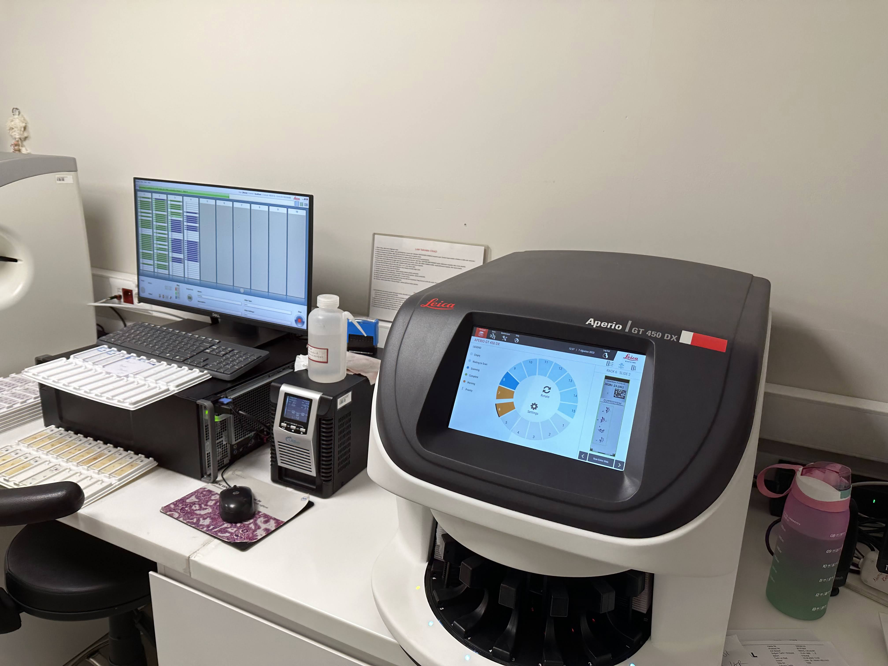{fig-align="center"}
:::

::: {.column width="30%"}
- Dijital Patoloji İçin Tarayıcı Şart mı?
- Dijital Patoloji Nerede Kullanılıyor?
:::

::::


::: {.notes}
Dijital patoloji deyince aklımıza hemen scanner geliyor. Koca bir makina ve değişik bir şey olduğu için ona odaklanıyoruz. Ama aslında tarama cihazları dijital patoloji için kısmen gerekli olsalar da yeterli değiller. 
:::


## Dijital Patoloji <br> Konsültasyon {auto-animate=true}

:::: {.columns}

::: {.column width="50%"}

:::

::: {.column width="50%"}

:::
::::


::: {.notes}
Kısmen gerekli olsalar da dedim, çünkü dijital patolojiyi konsültasyonlar için cep telefonlarıyla kullanabiliyoruz.
:::


## Dijital Patoloji <br> Konsültasyon {auto-animate=true}

:::: {.columns}

::: {.column width="50%"}
{fig-align="center"}

:::

::: {.column width="50%"}
{fig-align="center"}
:::
::::


## Dijital Patoloji <br> Manuel Tarama





## Dijital Patoloji <br> Frozen

:::: {.columns}

::: {.column width="50%"}

{fig-align="center"}

::: 


::: {.column width="50%"}

{fig-align="center"}

:::

:::: 


::: {.notes}
Frozen
:::


## Dijital Patoloji <br> Eğitim 


```{=html}
<iframe src="https://www.patolojiatlasi.com/wsi.html" width="100%" height="600px"> </iframe>
```


::: {.footer}
[patolojiatlasi.com](https://www.patolojiatlasi.com/) [histopathologyatlas.com](https://www.histopathologyatlas.com/)
:::

::: {.notes}
Eğitim için var olan kaynaklar oldukça yeterli, biraz didiklemek gerekiyor. 
:::


## Patoloji Atlası {fullscreen=true}


```{=html}
<iframe src="https://images.patolojiatlasi.com/GBD3/HE.html" width="100%" height="150%"> </iframe>
```


::: {.footer}
[patolojiatlasi.com](https://www.patolojiatlasi.com/) [histopathologyatlas.com](https://www.histopathologyatlas.com/)
:::

## Dijital Patoloji <br> Araştırma


::: {.footer}
[cbioportal](http://www.cbioportal.org/) - [TCGA](https://portal.gdc.cancer.gov/)
:::

## Dijital Patoloji <br> Araştırma

{fig-align="center"}


::: {.footer}
Analysis of application of digital image analysis in histopathology quality control. <br> J Pathol Inform. 2023 Jul 3;14:100322. doi: 10.1016/j.jpi.2023.100322.
:::


::: {.notes}
Araştırma içinse hala daha işlenmeyi bekleyen petabytlarca açık veri var, ilgilenecekleri bekliyor.
- İki cam arasını sonunda sayısallaştırdık, şimdi analiz zamanı.[^1] 
[^1]: Burak Buyrukbilen
:::


## Dijital Patoloji <br> Rutin Tanı

:::: {.columns}

::: {.column width="30%"}
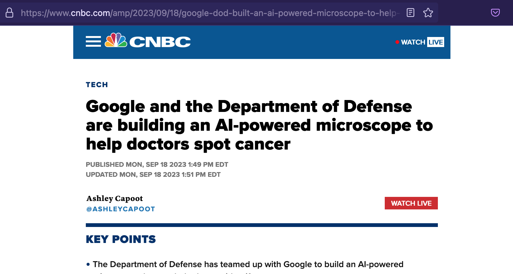

:::

::: {.column width="5%"}
:::

::: {.column width="30%"}

:::

::: {.column width="5%"}
:::


::: {.column width="30%"}

:::


::::


::: {.footer}
An augmented reality microscope with real-time artificial intelligence integration for cancer diagnosis. <br> Nat Med 25, 1453–1457 (2019). https://doi.org/10.1038/s41591-019-0539-7
:::

::: {.notes}
- [Independent assessment of a deep learning system for lymph node metastasis detection on the Augmented Reality Microscope](https://www.sciencedirect.com/science/article/pii/S2153353922007362)
- https://www.cnbc.com/amp/2023/09/18/google-dod-built-an-ai-powered-microscope-to-help-doctors-spot-cancer.html
- [An augmented reality microscope with real-time artificial intelligence integration for cancer diagnosis](https://www.nature.com/articles/s41591-019-0539-7)
:::


## Dijital Patoloji


::: {.panel-tabset}

### Tarayıcı Şart mı?

Kullanım ihtiyacınıza göre.

### Tarayıcı Olunca Dijital <br> Patolojiye Geçmiş Olur muyuz?

Tüm laboratuvarın entegre olmadığı bir durumda scanner pahalı bir fotoğraf makinası olarak kalacaktır.

:::


## Görüntünün Dijitalleştirilmesi <br> Patolojinin Verileştirilmesi <br> Sayısal Patoloji 

::: {.columns}


::: {.column width="60%"}


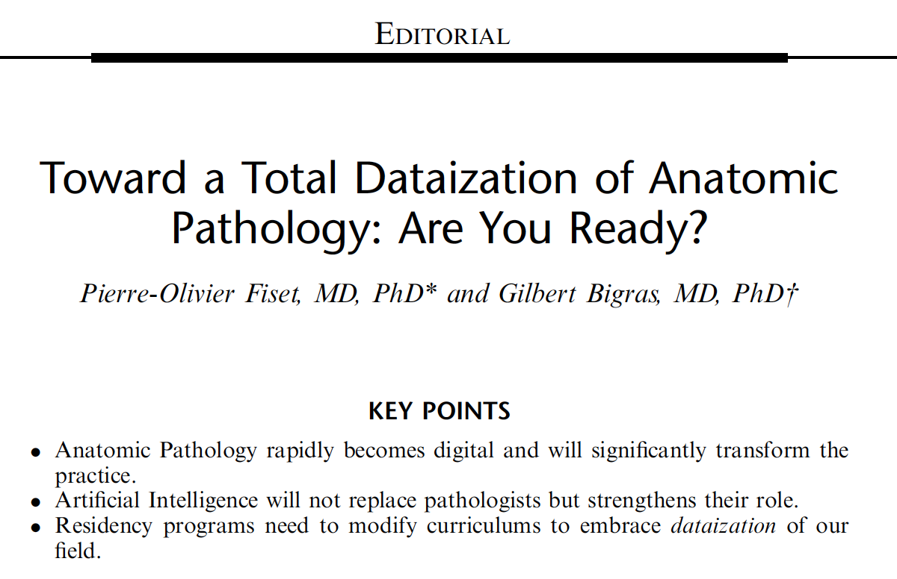
:::


::: {.column width="40%"}


:::

:::

::: {.footer}
Applied Immunohistochemistry & Molecular Morphology 31(8):p 531-532, September 2023.
:::


::: {.notes}
Applied Immunohistochemistry & Molecular Morphology 31(8):p 531-532, September 2023. | DOI: 10.1097/PAI.0000000000001145
:::


# Dijital Patoloji Nedir?

:::: {.columns}
::: {.column width="60%"}
{height="50%"}
:::
::: {.column width="40%"}

{width="40%"}
:::
::::


# Dijital Patoloji


::: {.panel-tabset}

### Zorluklar

- Alan yeni. 
- Çok fazla ön yargı var. 
- Maliyet. 
  - Para
  - Zaman
  - Emek

### Kolaylıklar

- Alan yeni. 
- Yapılabilecek ve öğrenilecek çok şey var. 
- Çoğu kişi bilgi ve deneyimini paylaşmaya hazır. 
- Ortak yapılacak çok şey var. 
- Tüm laboratuvarın kalitesini arttırıyor. 

:::


# Rutinden örnekler


- <https://memorial.patoloji.dev/webinar/>
- <https://dijital.patoloji.dev/>


:::: {.columns}

::: {.column width="50%" .smaller}


:::

::: {.column width="50%"}


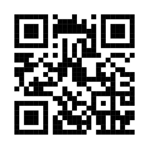

:::


::::

# Laboratuvar

## Alışkanlıklar


::: panel-tabset
### Zorluklar

- İşe eklenen bir basamak daha. 
- Nazlı bir basamak, onun yüzünden tüm laboratuvar huy değiştirmek zorunda.

### Kolaylıklar

- Cihazı rutin laboratuvar içine koyun.
- Alışması daha kolay.

:::

## Analitik Süreç

::: panel-tabset
### Eski Analitikler

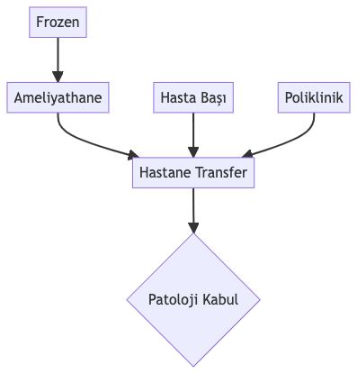{fig-align="center"}

### Yeni Preanalitikler

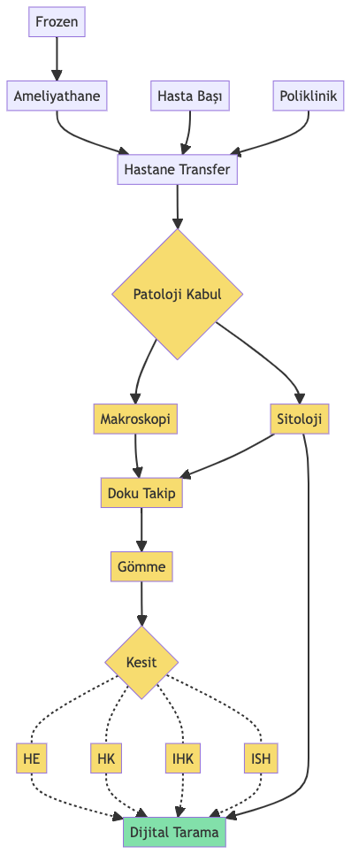{fig-align="center"}
:::

## Barkod, Karekod, Datamatrix

::: panel-tabset
### Zorluklar

-   Tüm basamaklarda barkod gerekli

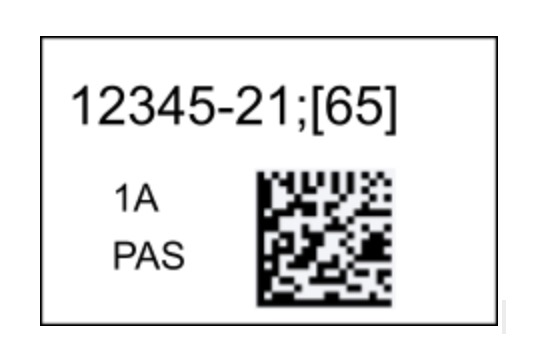{fig-align="center" width="30%"}


{fig-align="center" width="30%"}


-   Farklı firmalara ait cihazlarda ortak kod oluşturmalı
  - Cihazlar arası geçişte manuel yazım olmamalı
-   Cihazların kendine ait işleyiş kodu ile biyopsi numarası aynı kodda farklı olarak yer alması


{fig-align="center" width="30%"}


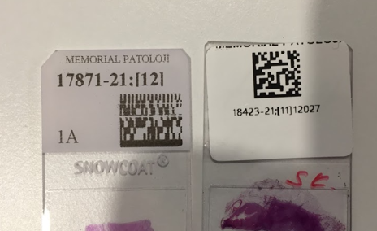{fig-align="center"}


- Barkod olmazsa
  - Uyumsuz olarak belirlenip geçici alana kopyalanıyor
  - El ile bunları taşımak gerekiyor
  - Bu sırada hatalar oluyor
  - Geçici alanda biriken dosyalar sistemin performansını düşürüyor
  - Lamdan haberi olmayan patolog raporu o lama bakmadan yazabiliyor

- Barkod yok, kaos var. 


### Kolaylıklar

-   Biyopsi numarası, Blok numarası, Boya ismi
-   Vakanın takibi, kontrol basamakları
-   Geri dönük tarama


-   Sanal mapenin düzgün oluşması
  - Lamların sıralı dizilmesi
  - HE ve Özel boyaların sıralı dizilmesi

{fig-align="center"}

{fig-align="center"}


- İlgili algoritması çalışacak lamların tespiti
  - Ki-67 düzgün bir şekilde düzgün yere yazılırsa bu lamda algoritma taramadan hemen sonra çalışacaktır. Aksi halde algoritmayı manuel çalıştırmak gerekecek. 
  - Prostat algoritmasını sadece tru-cut ise çalıştır


{fig-align="center"}


:::

## Makroskopi

-   Makroskopik görünütler biyopsi numaraları ile eşleşir
-   Görüntüler raporlama sırasında erişilebilir

<!-- {fig-align="center"} -->

<!-- {fig-align="center"} -->

{fig-align="center"}

{fig-align="center"}

{fig-align="center"}


{fig-align="center"}


## Gömme {auto-animate="true"}

Düzenli gömme

Bıçağa göre açılı gömme vs düz gömme

## Kesit {auto-animate="true"}

- 952 MB (40x)


:::: {.columns}

::: {.column width="50%"}
- 106 MB


:::

::: {.column width="50%"}
- 99 MB


:::

::::


Kesit kalınlığı

Kesitin merkezde olması

Katlantılar

## Kapama

- Baloncuk
- Lam ve lamel kalınlığı

{fig-align="center"}

{fig-align="center"}


- Sığmayan lamları zorlamamak lazım


{fig-align="center"}


## Temizlik

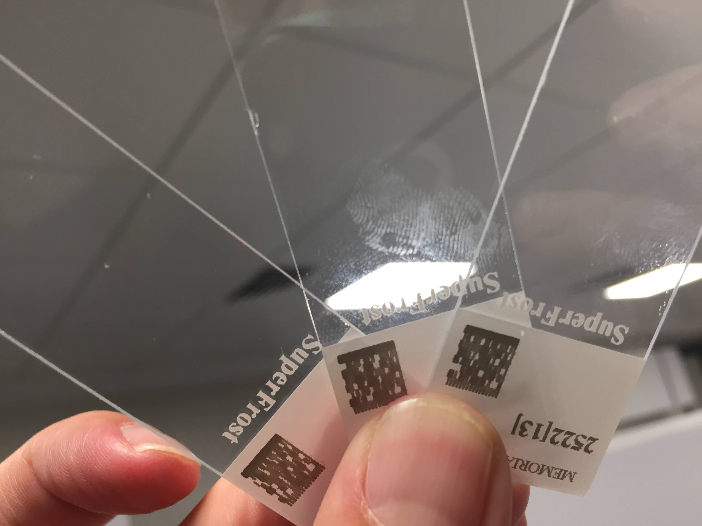{fig-align="center"}

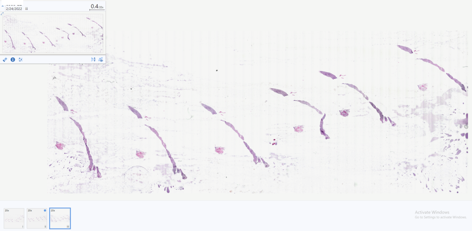{fig-align="center"}


## Doku sanılan artefaktlar

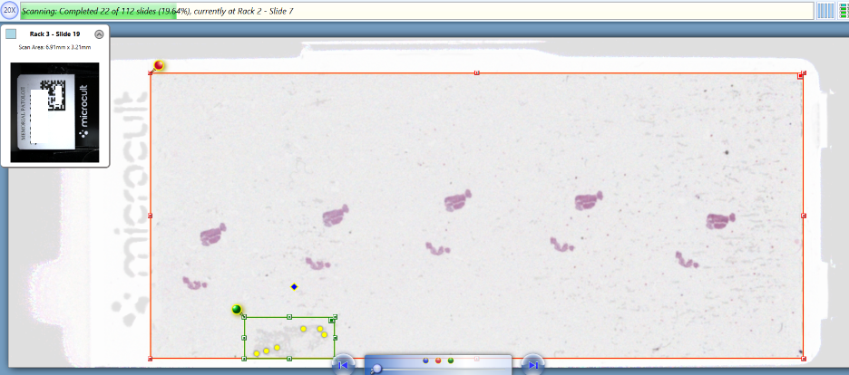{fig-align="center"}

<!-- {fig-align="center"} -->

<!-- {fig-align="center"} -->


## Odaklanma sorunu

{fig-align="center"}


## Kalibrasyon

{fig-align="center"}

{fig-align="center"}





## Hastane BYS, Laboratuvar BYS

::: panel-tabset
### Zorluklar

-   Farklı firmalar.
-   Değişen firmalar.

### Kolaylıklar

-   Entegre sistem ile tüm kliniğe ve eski tetkiklere kolay ulaşım.
:::

## PACS, Depo, Arşiv

::: panel-tabset
### Zorluklar

{fig-align="center"}

{fig-align="center"}


### Kolaylıklar
- Eski biyopsilere kolayca ulaşıp karşılaştırma yapabilme. 
- Fiziki arşiv hala en iyi yedek.  
  - Ama lamlar soluyor, tozlanıyor, çiziliyor. 

:::

## Hangi Arşiv?

::: panel-tabset

### Kağıt ve cam arşiv


### Dijital arşiv


:::

## İş Akışı

::: panel-tabset

### Zorluklar


### Kolaylıklar


:::

# Patolog

## Alışkanlıklar


::: {.panel-tabset}

### Zorluklar


### Kolaylıklar

- Validasyon çalışmaları: Alışma süreci

:::

## Alışkanlıklar - 2

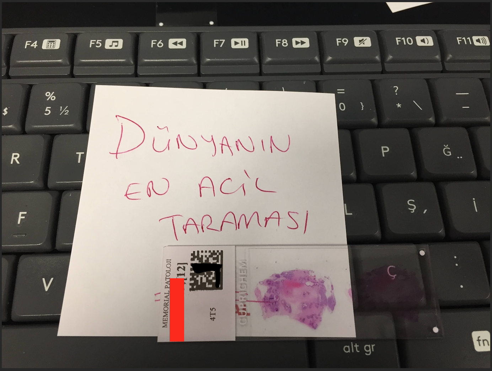

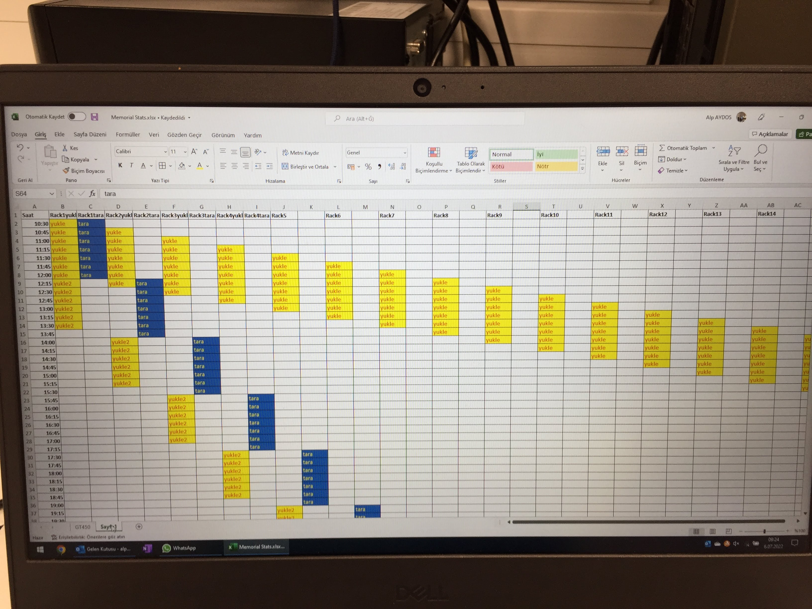

## Ekran

::: {.panel-tabset}

### Zorluklar

- Yeni kuşak patolojinin yeni ergonomi sorunları
- Yeni bir postür
- Yeni bir çalışma düzeni

### Kolaylıklar

- Geniş alanda bakma.
- 1x, 2x büyütme

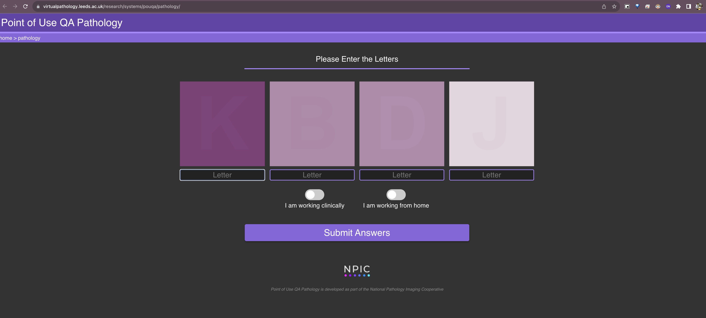

- ICC profile


:::{.footer}
[Point of Use QA Pathology](https://www.virtualpathology.leeds.ac.uk/research/systems/pouqa/pathology/)
:::

:::


## Navigasyon


::: {.panel-tabset}

### Zorluklar

- Yeni kuşak patolojinin yeni ergonomi sorunları
- Kas hafızası 

<!-- [](https://twitter.com/FIDE_chess/status/1693220998202499482) -->

<blockquote class="twitter-tweet"><p lang="en" dir="ltr">When your muscle memory kicks in and you try to shake hands before the game, but your opponent is missing! <a href="https://twitter.com/hashtag/FIDEWorldCup?src=hash&amp;ref_src=twsrc%5Etfw">#FIDEWorldCup</a> <a href="https://t.co/yInEUqpyJC">pic.twitter.com/yInEUqpyJC</a></p>&mdash; International Chess Federation (@FIDE_chess) <a href="https://twitter.com/FIDE_chess/status/1693220998202499482?ref_src=twsrc%5Etfw">August 20, 2023</a></blockquote> <script async src="https://platform.twitter.com/widgets.js" charset="utf-8"></script>


### Kolaylıklar

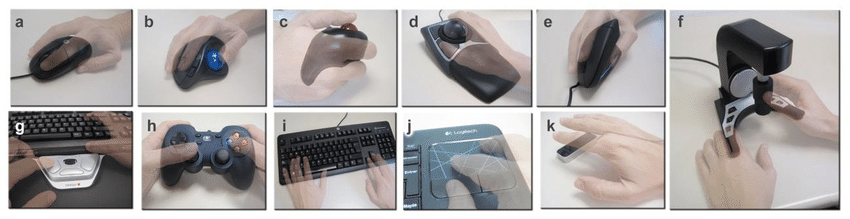


<!--  -->








<!--  -->


:::


## Navigasyon <br> Çoklu (Senkron) Ekran





## Not yazma

- Manuel notlar


- Dijital notlar


- Standart notlar?


::: {.footer}
Standardized Clinical Annotation of Digital Histopathology Slides at the Point of Diagnosis <br>
Modern Pathology Volume 36, Issue 11, November 2023, 100297
:::


## Vakanın tümü tarandı mı?


<!-- 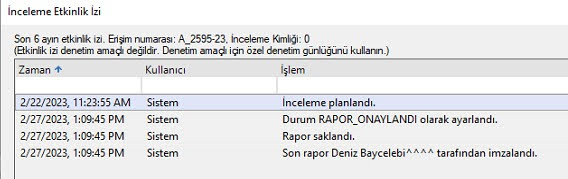 -->

::: {.panel-tabset}

### Zorluklar

- Radyoloji mantığında tekniker görüntüleri hazırlayıp gönderiyor
- Patolojide tüm lamların tarandığından emin olmak lazım


### Kolaylıklar

- Eğer PBYS yeterli ise her lamın bilgisi olacağından eksik lamlar tespit edilecektir.
- Sadece blok sayısını karşılaştırmak yeterli değil:
  - Sitoloji
  - (İmmüno)histokimya
  - yeni kesitler, çoklu kesitler


:::


## Lamın tümü tarandı mı?


## Lamın tümü tarandı mı?


::: {.panel-tabset}

### Zorluklar

- Tüm lamı tararsak boşluklar gereksiz yer kaplıyor. 
- Otomatik doku tespiti küçük dokuları atlayabiliyor. 

### Kolaylıklar

- Boş şeritleri atlayarak tarama.
- Otomatik doku tespiti. 
- Alan seçerek tarama. 
- Literatürde atlanan küçük dokuların tanısal sorun yaratmadığına dair çalışmalar var.
  - Ama bu patolog obsesyonuna çare değil. 


:::

:::{.footer}
Potential quality pitfalls of digitalized whole slide image of breast pathology in routine practice <br> Mod Pathol 35, 903–910 (2022)
:::


## Lamın tümüne baktık mı?

::: {.panel-tabset}

### Cama işaretleme


### Dijital işaretleme





:::


## Çalışma Hayatı


::: {.panel-tabset}

### Zorluklar

- Her zaman, her yerde çalışma.


### Kolaylıklar

- İstediğin zaman, istediğin yerde çalışabilme.  
- Şehir, ülke, saat sınırlaması kalmadı. 
- Yurtdışında çoğu merkez konsültasyon için dijital görüntüleri kabul etmeye başladı. 
- Konsültasyon kolaylaştı. 
- İş listeleri


:::


# Sitoloji

## Preparatın taranması

::: {.panel-tabset}

### Zorluklar

- Odaklanma
- Z-stack

### Kolaylıklar

- Sıvı bazlı
- Alan küçük 

:::


## Patoloğun taraması


::: {.panel-tabset}

### Zorluklar

- Büyük büyütmede tüm alanlara bakmak lazım.
- Patern analizi kısıtlı.

### Kolaylıklar

- ??

:::


# Başka Sefere {.smaller}

::: {.panel-tabset}

### Tarama

- Hangi tarama cihazı
- Cihazın tarama hızı
- Cihazın sunucu ile bağlantı hızı
- Sunucu kullanıcı ile bağlantı hızı
- HBYS, PBYS entegrasyonu
- Işık netlik ayarı
- Tarma şekli
  - Tüm lam
  - Doku tespiti
- Dizme sırası
- Racklardaki boşluklar
- Taramanın durdurulması
- Tarama kalitesi
- 20x vs 40x
- Farklı lamlar
  - Cam lamel
  - Kalın lam
  - Mega kaset

### Arayüz
- Patolojiye uygun arayüz
- Sanal mape
- Annotasyon / İşaretleme

### Araştırma
- Vaka seçimi
- Rapor etiketlemesi
  - Metin madenciliği
- Görüntülerin export edilmesi
- Anonimleştirme

### Yapay Zeka
- Yapay zeka hangi lamlarda kullanılabilir.
- Lokal mi, bulut mu?


:::


# Teşekkürler


Sonuçta her zorluk bir kolaylıkla beraber geliyor. <br>
En iyisi bir işi bitirince hemen diğerine başlamak.


::: {.columns .v-center-container}
::: {.column width="60%"}
`<svg aria-hidden="true" role="img" viewBox="0 0 640 512" style="height:1em;width:1.25em;vertical-align:-0.125em;margin-left:auto;margin-right:auto;font-size:inherit;fill:#606060;overflow:visible;position:relative;"><path d="M579.8 267.7c56.5-56.5 56.5-148 0-204.5c-50-50-128.8-56.5-186.3-15.4l-1.6 1.1c-14.4 10.3-17.7 30.3-7.4 44.6s30.3 17.7 44.6 7.4l1.6-1.1c32.1-22.9 76-19.3 103.8 8.6c31.5 31.5 31.5 82.5 0 114L422.3 334.8c-31.5 31.5-82.5 31.5-114 0c-27.9-27.9-31.5-71.8-8.6-103.8l1.1-1.6c10.3-14.4 6.9-34.4-7.4-44.6s-34.4-6.9-44.6 7.4l-1.1 1.6C206.5 251.2 213 330 263 380c56.5 56.5 148 56.5 204.5 0L579.8 267.7zM60.2 244.3c-56.5 56.5-56.5 148 0 204.5c50 50 128.8 56.5 186.3 15.4l1.6-1.1c14.4-10.3 17.7-30.3 7.4-44.6s-30.3-17.7-44.6-7.4l-1.6 1.1c-32.1 22.9-76 19.3-103.8-8.6C74 372 74 321 105.5 289.5L217.7 177.2c31.5-31.5 82.5-31.5 114 0c27.9 27.9 31.5 71.8 8.6 103.9l-1.1 1.6c-10.3 14.4-6.9 34.4 7.4 44.6s34.4 6.9 44.6-7.4l1.1-1.6C433.5 260.8 427 182 377 132c-56.5-56.5-148-56.5-204.5 0L60.2 244.3z"/></svg>`{=html}
[serdarbalci.com](https://www.serdarbalci.com/)

`<svg aria-hidden="true" role="img" viewBox="0 0 512 512" style="height:1em;width:1em;vertical-align:-0.125em;margin-left:auto;margin-right:auto;font-size:inherit;fill:#606060;overflow:visible;position:relative;"><path d="M459.37 151.716c.325 4.548.325 9.097.325 13.645 0 138.72-105.583 298.558-298.558 298.558-59.452 0-114.68-17.219-161.137-47.106 8.447.974 16.568 1.299 25.34 1.299 49.055 0 94.213-16.568 130.274-44.832-46.132-.975-84.792-31.188-98.112-72.772 6.498.974 12.995 1.624 19.818 1.624 9.421 0 18.843-1.3 27.614-3.573-48.081-9.747-84.143-51.98-84.143-102.985v-1.299c13.969 7.797 30.214 12.67 47.431 13.319-28.264-18.843-46.781-51.005-46.781-87.391 0-19.492 5.197-37.36 14.294-52.954 51.655 63.675 129.3 105.258 216.365 109.807-1.624-7.797-2.599-15.918-2.599-24.04 0-57.828 46.782-104.934 104.934-104.934 30.213 0 57.502 12.67 76.67 33.137 23.715-4.548 46.456-13.32 66.599-25.34-7.798 24.366-24.366 44.833-46.132 57.827 21.117-2.273 41.584-8.122 60.426-16.243-14.292 20.791-32.161 39.308-52.628 54.253z"/></svg>`{=html}
[\@serdarbalci](https://twitter.com/serdarbalci)

`<svg aria-hidden="true" role="img" viewBox="0 0 448 512" style="height:1em;width:0.88em;vertical-align:-0.125em;margin-left:auto;margin-right:auto;font-size:inherit;fill:#606060;overflow:visible;position:relative;"><path d="M416 32H31.9C14.3 32 0 46.5 0 64.3v383.4C0 465.5 14.3 480 31.9 480H416c17.6 0 32-14.5 32-32.3V64.3c0-17.8-14.4-32.3-32-32.3zM135.4 416H69V202.2h66.5V416zm-33.2-243c-21.3 0-38.5-17.3-38.5-38.5S80.9 96 102.2 96c21.2 0 38.5 17.3 38.5 38.5 0 21.3-17.2 38.5-38.5 38.5zm282.1 243h-66.4V312c0-24.8-.5-56.7-34.5-56.7-34.6 0-39.9 27-39.9 54.9V416h-66.4V202.2h63.7v29.2h.9c8.9-16.8 30.6-34.5 62.9-34.5 67.2 0 79.7 44.3 79.7 101.9V416z"/></svg>`{=html}
[serdar-balci-md-pathologist](https://www.linkedin.com/in/serdar-balci-md-pathologist/)

`<svg aria-hidden="true" role="img" viewBox="0 0 496 512" style="height:1em;width:0.97em;vertical-align:-0.125em;margin-left:auto;margin-right:auto;font-size:inherit;fill:#606060;overflow:visible;position:relative;"><path d="M165.9 397.4c0 2-2.3 3.6-5.2 3.6-3.3.3-5.6-1.3-5.6-3.6 0-2 2.3-3.6 5.2-3.6 3-.3 5.6 1.3 5.6 3.6zm-31.1-4.5c-.7 2 1.3 4.3 4.3 4.9 2.6 1 5.6 0 6.2-2s-1.3-4.3-4.3-5.2c-2.6-.7-5.5.3-6.2 2.3zm44.2-1.7c-2.9.7-4.9 2.6-4.6 4.9.3 2 2.9 3.3 5.9 2.6 2.9-.7 4.9-2.6 4.6-4.6-.3-1.9-3-3.2-5.9-2.9zM244.8 8C106.1 8 0 113.3 0 252c0 110.9 69.8 205.8 169.5 239.2 12.8 2.3 17.3-5.6 17.3-12.1 0-6.2-.3-40.4-.3-61.4 0 0-70 15-84.7-29.8 0 0-11.4-29.1-27.8-36.6 0 0-22.9-15.7 1.6-15.4 0 0 24.9 2 38.6 25.8 21.9 38.6 58.6 27.5 72.9 20.9 2.3-16 8.8-27.1 16-33.7-55.9-6.2-112.3-14.3-112.3-110.5 0-27.5 7.6-41.3 23.6-58.9-2.6-6.5-11.1-33.3 2.6-67.9 20.9-6.5 69 27 69 27 20-5.6 41.5-8.5 62.8-8.5s42.8 2.9 62.8 8.5c0 0 48.1-33.6 69-27 13.7 34.7 5.2 61.4 2.6 67.9 16 17.7 25.8 31.5 25.8 58.9 0 96.5-58.9 104.2-114.8 110.5 9.2 7.9 17 22.9 17 46.4 0 33.7-.3 75.4-.3 83.6 0 6.5 4.6 14.4 17.3 12.1C428.2 457.8 496 362.9 496 252 496 113.3 383.5 8 244.8 8zM97.2 352.9c-1.3 1-1 3.3.7 5.2 1.6 1.6 3.9 2.3 5.2 1 1.3-1 1-3.3-.7-5.2-1.6-1.6-3.9-2.3-5.2-1zm-10.8-8.1c-.7 1.3.3 2.9 2.3 3.9 1.6 1 3.6.7 4.3-.7.7-1.3-.3-2.9-2.3-3.9-2-.6-3.6-.3-4.3.7zm32.4 35.6c-1.6 1.3-1 4.3 1.3 6.2 2.3 2.3 5.2 2.6 6.5 1 1.3-1.3.7-4.3-1.3-6.2-2.2-2.3-5.2-2.6-6.5-1zm-11.4-14.7c-1.6 1-1.6 3.6 0 5.9 1.6 2.3 4.3 3.3 5.6 2.3 1.6-1.3 1.6-3.9 0-6.2-1.4-2.3-4-3.3-5.6-2z"/></svg>`{=html}
[sbalci](https://github.com/sbalci/)
:::

::: {.column width="40%"}

:::
:::

## Patoloji Atlası

::: columns
::: {.column width="60%"}
`<svg aria-hidden="true" role="img" viewBox="0 0 640 512" style="height:1em;width:1.25em;vertical-align:-0.125em;margin-left:auto;margin-right:auto;font-size:inherit;fill:#606060;overflow:visible;position:relative;"><path d="M579.8 267.7c56.5-56.5 56.5-148 0-204.5c-50-50-128.8-56.5-186.3-15.4l-1.6 1.1c-14.4 10.3-17.7 30.3-7.4 44.6s30.3 17.7 44.6 7.4l1.6-1.1c32.1-22.9 76-19.3 103.8 8.6c31.5 31.5 31.5 82.5 0 114L422.3 334.8c-31.5 31.5-82.5 31.5-114 0c-27.9-27.9-31.5-71.8-8.6-103.8l1.1-1.6c10.3-14.4 6.9-34.4-7.4-44.6s-34.4-6.9-44.6 7.4l-1.1 1.6C206.5 251.2 213 330 263 380c56.5 56.5 148 56.5 204.5 0L579.8 267.7zM60.2 244.3c-56.5 56.5-56.5 148 0 204.5c50 50 128.8 56.5 186.3 15.4l1.6-1.1c14.4-10.3 17.7-30.3 7.4-44.6s-30.3-17.7-44.6-7.4l-1.6 1.1c-32.1 22.9-76 19.3-103.8-8.6C74 372 74 321 105.5 289.5L217.7 177.2c31.5-31.5 82.5-31.5 114 0c27.9 27.9 31.5 71.8 8.6 103.9l-1.1 1.6c-10.3 14.4-6.9 34.4 7.4 44.6s34.4 6.9 44.6-7.4l1.1-1.6C433.5 260.8 427 182 377 132c-56.5-56.5-148-56.5-204.5 0L60.2 244.3z"/></svg>`{=html} [Patoloji
Atlası](https://www.patolojiatlasi.com/)
:::

::: {.column width="40%"}
`<svg aria-hidden="true" role="img" viewBox="0 0 640 512" style="height:1em;width:1.25em;vertical-align:-0.125em;margin-left:auto;margin-right:auto;font-size:inherit;fill:#606060;overflow:visible;position:relative;"><path d="M579.8 267.7c56.5-56.5 56.5-148 0-204.5c-50-50-128.8-56.5-186.3-15.4l-1.6 1.1c-14.4 10.3-17.7 30.3-7.4 44.6s30.3 17.7 44.6 7.4l1.6-1.1c32.1-22.9 76-19.3 103.8 8.6c31.5 31.5 31.5 82.5 0 114L422.3 334.8c-31.5 31.5-82.5 31.5-114 0c-27.9-27.9-31.5-71.8-8.6-103.8l1.1-1.6c10.3-14.4 6.9-34.4-7.4-44.6s-34.4-6.9-44.6 7.4l-1.1 1.6C206.5 251.2 213 330 263 380c56.5 56.5 148 56.5 204.5 0L579.8 267.7zM60.2 244.3c-56.5 56.5-56.5 148 0 204.5c50 50 128.8 56.5 186.3 15.4l1.6-1.1c14.4-10.3 17.7-30.3 7.4-44.6s-30.3-17.7-44.6-7.4l-1.6 1.1c-32.1 22.9-76 19.3-103.8-8.6C74 372 74 321 105.5 289.5L217.7 177.2c31.5-31.5 82.5-31.5 114 0c27.9 27.9 31.5 71.8 8.6 103.9l-1.1 1.6c-10.3 14.4-6.9 34.4 7.4 44.6s34.4 6.9 44.6-7.4l1.1-1.6C433.5 260.8 427 182 377 132c-56.5-56.5-148-56.5-204.5 0L60.2 244.3z"/></svg>`{=html} [Histopathology
Atlas](https://www.histopathologyatlas.com/)
:::
:::

::: columns
::: {.column width="40%"}

:::

::: {.column width="20%"}
:::

::: {.column width="40%"}
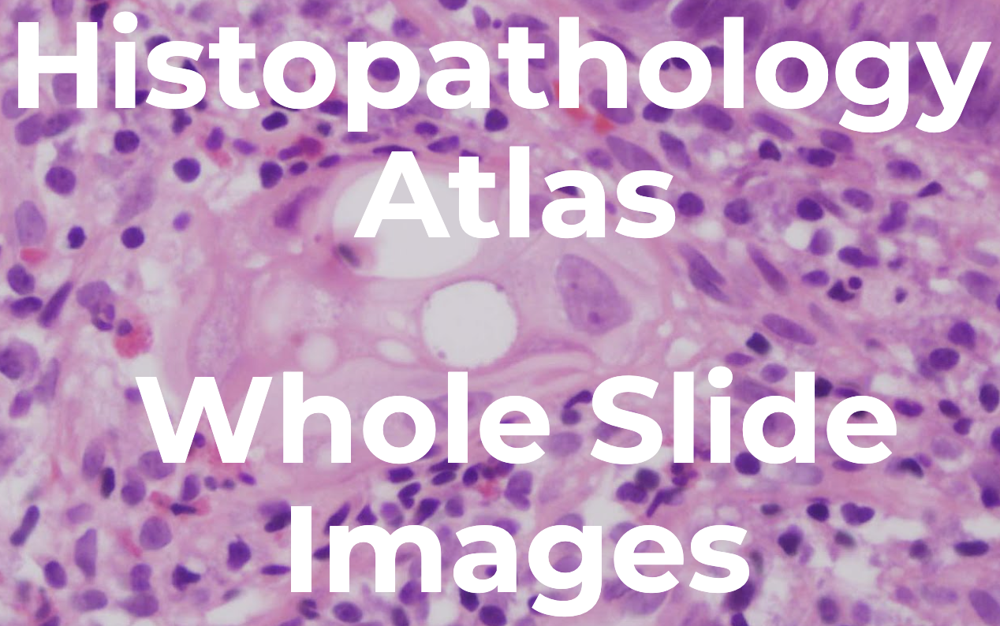
:::
:::


::: {.footer}
[patolojiatlasi.com](https://www.patolojiatlasi.com/) [histopathologyatlas.com](https://www.histopathologyatlas.com/)
:::


## 

::: columns
::: {.column width="60%"}
`Örnek Rutin Vakalar`

-   [memorial.patoloji.dev/webinar](https://memorial.patoloji.dev/webinar/)
-   [dijital.patoloji.dev](https://dijital.patoloji.dev/)
:::

::: {.column width="40%"}
`patolojiatlasi.com`
:::
:::

::: columns
::: {.column width="33%"}
{width="70%"}
:::

::: {.column width="33%"}
{width="70%"}
:::

::: {.column width="33%"}
{width="70%"}
:::
:::

{.absolute left="35%" width="20%"}


::: {.notes}
- [Günlük Pratiğimizde Dijital Patoloji](https://docs.google.com/presentation/d/1fEoaAVI-Jegt7OFZKPnnFLvhnF8swvpP6sEhoKDSFa8/)

- [Dijital Patolojiye Geçerken](https://docs.google.com/document/d/10osEzn36YuIaLW8qQp3ANuQeCZi-SqJkA5LV-R7bcWU/edit#heading=h.vk8e6k5f2h73)

- [Patolojide Yapay Zeka](https://docs.google.com/presentation/d/1o1Glh4xTOPYEjX0s9uUKxwhEdwj7NZa7pj7fjZv6gAE/edit#slide=id.p)

- [Leeds Guide to Digital Pathology](https://www.serdarbalci.com/edufiles/18778_Leeds_Guide_to_Digital_Pathology_Brochure_A4_final_hi.pdf)

- [The Leeds Guide to Digital Pathology Volume 2](https://www.serdarbalci.com/edufiles/Horizontal_Leeds_guide_032222_whtpg1.pdf)

:::

